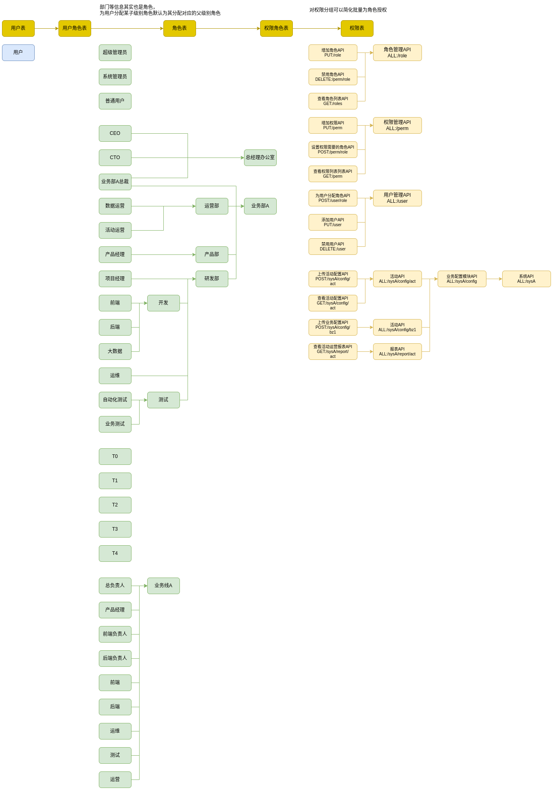

# 权限管理设计：RBAC 与 ABAC

## 权限模型基础

首先需要了解 RBAC、ABAC 的工作原理、特点，资料很多不赘述。

**RBAC 权限模型**：

基本三要素：用户-角色-权限，角色与权限相关联，然后通过给用户附加角色的方式间接赋予权限；

**RBAC 细分模型**：

**RBAC0**:

用户和角色、角色和权限多对多关系。

**RBAC1**:

基于 RBAC0 基础上增加**角色分级**，即角色下面包含一些子角色，下一层级的角色继承上一层级的所有权限。
比如：开发人员包含初中高级开发、架构师、CTO，设置一个项目的源码对开发人员这个角色开放，就自动向所有包含子类任一角色的人员开发。

关于角色分级其实网上更多的表现是 “**组**”的概念。

**RBAC2**:

基于 RBAC0 对角色增加了**约束**条件，举个不太恰当的例子比如一个人不能同时拥有球员和裁判两种角色。
业务中同样拥有这种类似情况所以需要引入角色约束。

约束示例：

+ 角色互斥，一个人具备某个角色，就不应该再被授予另一个角色
+ 角色容量，一个角色能够授予的人数有上限，超出后不能再授予更多人
+ 先决条件角色，仅当一个用户属于某个角色时，他才能被授予另一个角色
+ 运行时排斥，一个用户可以同时具备两个角色，但是这两个角色同一时间只能激活一个角色使用

> 约束条件怎么实现？
>
> 前三种都是**授予角色时的约束，属于act 行为过程不属于鉴权过程**，以 Casbin 为例，带约束条件的角色授予一定不要通过配置文件设置，比如
>
> ```ini
> # 不要通过这种方式实现，很难实现约束限制
> g, 10001, ROLE_SUPER_ADMIN
> ```
>
> 而应该由管理员通过接口（比如 /user/role）授予角色，这样只需要在接口中先检查约束是否满足再决定是否授予角色即可。
>
> ```java
> //先检查约束
> checkConstraint(...)
> //再授予角色 
> enforcer.addRoleForUser(...)
> ```
>
> 第四种属于**鉴权过程中的约束**，不过激活过程可以在鉴权后的 act 行为中实现。
>
> Casbin 实际项目中尽量**不要通过 policy.csv 进行角色授予操作**，否则容易被误导将角色授予操作放到鉴权规则中。
>
> Casbin 中有个[条件角色管理器](https://casbin.org/zh/docs/rbac-with-conditions), 定义**什么条件下可以为用户赋予某个角色**，其实并不是适用于实现 RBAC2，这个角色的授予操作是在鉴权过程中临时授予的，鉴权之后这个角色用户就没有了，仅仅适用于临时角色，而 RBAC2 授予的角色都是持久的。

**RBAC3**：

基于 RBAC0 同时增加了**角色分级**和**约束**条件。

**ABAC 权限模型**：

基于属性的访问控制。每个属性需要实现一个权限校验方法，RBAC 是为用户绑定角色间接授权，ABAC 则是为用户绑定属性方法进行授权。

属性示例（用户访问网站的例子）：

+ 主体属性，如用户年龄、性别等；
+ 客体属性，如一篇文章等；
+ 环境属性，即空间限制、时间限制、频度限制；
+ 操作属性，即行为类型，如读写、只读等。

> 比如：仅仅允许年龄超过18岁的大陆用户访问某篇文章，这里涉及两个属性：18岁以上、大陆用户，如果年龄、空间随着业务不会变，使用RBAC也可以实现，比如新定义两种角色：成人、大陆用户，但是如果年龄、空间限制经常变的话，就应该使用ABAC实现。
> 可以参考 Casbin 中各种权限模型的数据结构深入理解。

**RBAC vs ABAC**

RBAC 必须通过角色进行授权，规则明确实现简单，但是控制严格缺乏灵活性。
ABAC 通过计算用户属性判定用户权限，实现灵活，但是规则复杂，主体和客体间的规则可能很复杂，不容易维护。

**拓展权限管理**：

+ **基础角色自动分配**

  简化用户角色分配的手动管理，比如新员工以后端架构师身份加入业务部，以后面的角色分级为例应该自动为用户分配系统管理员角色。

+ **临时角色与失效时间**

  临时授予用户权限。

+ **黑白名单**

  临时取消用户的权限。

+ **Deny权限**

  取消授权，相对应的是 Allow，比如**开发**角色组中，仅对中级、高级、架构师、项目经理开放某项权限，不对初级开发开放此权限。
  可以给开发组配置此权限，然后给初级开发组配置此权限对应的Deny权限。

**权限分层细分**：

比如前端资源的 页面 -> 菜单 -> 按钮。

拥有某页面的操作权限，就自动拥有页面下所有菜单、按钮的权限。


## 结合场景设计

> 如果没有接触到很复杂的权限管理项目，没有针对里面每一个设计点实战过的话，感觉很难一步到位设计出一个完善的权限管理系统。

这里举个某项目管理后台的例子，用户是项目团队的所有成员以及管理层成员，管理后台有运营、报表等等资源分别针对部分用户开放。

这里尽可能多地添加一些需求案例，分析整合设计权限管理的数据结构。

### 管理后台的组成

+ 用户管理
+ 权限管理
+ 业务配置
+ 运营与报表

### 需求用例

实际设计前需要将业务中所有权限控制需求用例列举出来。

+ 权限管理

  + 给高级运维、架构师等极少数人默认分配超级管理员角色。

  + 给运维、高级开发等少数人默认分配系统管理员角色。

  + 超级管理员、系统管理员角色可以增删角色、增加权限、设置角色对应的权限。

    > 角色和权限上线后不要修改不要硬删除（不需要时标记禁用）。

  + 当前业务部所有人员可以查看当前部门分级角色、权限列表。
  + 超级管理员、系统管理员角色可以新增、禁用角色分组。

+ 用户管理

  + 超级管理员、系统管理员角色可以对部门团队人员进行增删改查。
  + 系统中所有人员可以对部门团队人员进行查操作。

+ 业务配置

  + 新建业务线中的角色的分配需要依赖部门架构的角色，比如可以被分配新建业务线A总负责人角色的人需要有项目经理的角色。
  + 某业务服务的配置文件上传操作仅仅可以由此业务线项目经理、后端架构师、高级开发执行。
  + 某业务服务的配置内容可以由负责此业务线的所有人员查看。

+ 运营与报表

  + 某业务线的运营活动配置可以由负责此业务线的运营人员、项目经理、开发人员进行提交。
  + 运营活动配置数据可以由负责此业务线的所有人员查看。
  + 某业务线的运营报表可以由此业务线的运营人员、总负责人、产品经理以及部门架构分级的总经理办公室人员查看。

然后将需求用例拆分成**角色表**、**资源表**。

### 角色与分级

用户组其实也属于角色范畴，是角色分级的体现。

**系统角色**：

不同业务部的系统基本都是分开管理的，这里的系统角色默认是对某个业务部。

+ 超级管理员

  给高级运维、架构师等极少数人默认分配的角色。

  拥有系统全部权限。

+ 系统管理员

  给高级开发等少数人默认分配的角色。

  拥有除了指派管理员外所有权限。

+ 普通用户

  给所有人默认分配的角色，添加权限时不指明需要的角色默认设置需要普通用户角色。

**部门架构的角色分级**：

+ 总经理办公室
  + CEO
  + CTO
  + 业务部A总裁
  + ...
+ 业务部A (有些大公司上面还有事业群)
  + 业务部A总裁
  + 运营部
    + 数据运营
    + 活动运营
  + 产品部
    + 产品经理
  + 研发部
    + 项目经理
    + 开发
      + 前端
      + 后端
      + 大数据
    + 运维
    + 测试
  
+ 业务部B
+ ...

**职级的角色分级**：

假设分为5层，T0 - T4，比如初/中/高级工程师、架构师、CTO分别对应 T0-T4。

**业务线的角色分级**：

+ 业务线A
  + 总负责人
  + 产品经理
  + 前端负责人
  + 后端负责人
  + 前端开发
  + 后端开发
  + 运维
  + 测试
  + 运营
+ 业务线B
+ ...

### 数据结构设计



### Casbin表数据

这里做上述需求用例分析，将用例转成 Casbin 模型（这里使用 RBAC 与 ABAC 模型）和表数据。

**向 Enforcer 提交请求后，会先通过 matchers 中的匹配器查找与请求匹配的策略规则（p），可能查找到的规则有多条且结果可能不同，最终由 policy_effect 综合多个规则的授权结果返回最终结果**。

+ 权限管理

  + 给高级运维、架构师等极少数人默认分配超级管理员角色。

    数据库中直接设置就可以。

  + 给运维、高级开发等少数人默认分配系统管理员角色。

    通过超级管理员分配。先创建用户和系统管理员角色，然后通过用户角色表为用户绑定角色。

  + 超级管理员、系统管理员角色可以增删角色、增加权限、设置角色对应的权限。

    解析为 Casbin 模型和策略数据为：

    ```ini
    #对应模型定义：
    [request_definition]
    r = sub, obj, act
    [policy_definition]
    p = sub, obj, act
    [role_definition]
    # g g2 格式明明一样为何写两次，仅仅为了在策略规则文件中区分 用户继承角色 与 角色继承角色
    g = _, _
    g2 = _, _
    [policy_effect]
    # 如果有多条规则匹配请求，则有任意一条规则返回allow且没有规则返回deny即授权通过
    e = some(where (p.eft == allow)) && !some(where (p.eft == deny))
    [matchers]
    # 用于获取与请求匹配的策略规则
    # 即要求请求主体继承策略主体角色，请求目标可以"*"匹配策略目标，...
    m = g(r.sub, p.sub) && keyMatch(r.obj, p.obj) && (r.act == p.act || p.act == "*")
    
    #对应策略数据：
    p, ROLE_SUPER_ADMIN, /role, *
    p, ROLE_SUPER_ADMIN, /perm/*, *
    p, ROLE_SYS_ADMIN, /role, *
    p, ROLE_SYS_ADMIN, /perm/*, *
    # 数字是userId
    g, 10001, ROLE_SUPER_ADMIN
    g, 10001, ROLE_NORMAL
    g, 10002, ROLE_SYS_ADMIN
    g, 10002, ROLE_NORMAL
    
    # 测试，https://casbin.org/zh/editor/
    # true true false true
    10001, /role, PUT
    10002, /perm/role, POST
    ```

  + 当前业务部所有人员可以查看当前部门分级角色、权限列表。

    ```ini
    p, ROLE_NORMAL, /role, GET
    p, ROLE_NORMAL, /perm, GET
    g, 10003, ROLE_NORMAL
    ```

  + 超级管理员、系统管理员角色可以新增、禁用角色分组。

    对于 Casbin 角色分组和角色没有差别。

+ 用户管理

  + 超级管理员、系统管理员角色可以对部门团队人员进行增删改查。
  + 系统中所有人员可以对部门团队人员进行查操作。

  ```ini
  #上面这两条对应策略数据：
  p, ROLE_SUPER_ADMIN, /user, *
  p, ROLE_SYS_ADMIN, /user, *
  p, ROLE_NORMAL, /user, GET
  
  g, 10001, ROLE_SUPER_ADMIN
  g, 10001, ROLE_NORMAL
  g, 10002, ROLE_SYS_ADMIN
  g, 10002, ROLE_NORMAL
  g, 10003, ROLE_NORMAL
  ```

+ 业务配置

  + 新建业务线中的角色的分配需要依赖部门架构的角色，比如超级管理员为员工分配新建业务线A产品经理角色的前提是员工需要有企业架构分级中项目经理的角色。

    注意这里面分为两个过程一个是鉴权（用户是否有超级管理员角色能否执行为员工分配角色的操作），一个是鉴权通过后为某个用户分配业务线A产品经理角色的操作（act）。不要将这两个过程都放到鉴权规则中实现。

  + 某业务服务的配置文件上传操作仅仅可以由此业务线项目经理、后端架构师、高级开发执行。

    ```ini
    #对应模型定义：
    [request_definition]
    r = sub, obj, act
    r2 = sub, obj, act
    [policy_definition]
    p = sub, obj, act
    p2 = sub, sub2, obj, act
    [role_definition]
    g = _, _
    [policy_effect]
    e = some(where (p.eft == allow)) && !some(where (p.eft == deny))
    e2 = some(where (p.eft == allow)) && !some(where (p.eft == deny))
    [matchers]
    m = g(r.sub, p.sub) && r.obj == p.obj && r.act == p.act
    m2 = g(r2.sub, p2.sub) && g(r2.sub, p2.sub2) && r2.obj == p2.obj && r2.act == p2.act
    
    #对应策略数据：
    p, ROLE_BIZA_PM, /sysA/config/bz1, POST
    p2, ROLE_BIZA_BACKEND, ROLE_T3, /sysA/config/bz1, POST
    p2, ROLE_BIZA_BACKEND, ROLE_T2, /sysA/config/bz1, POST
    g, 10005, ROLE_BIZA_PM
    g, 10006, ROLE_BIZA_BACKEND
    g, 10006, ROLE_T3
    g, 10007, ROLE_BIZA_BACKEND
    g, 10007, ROLE_T2
    g, 10008, ROLE_BIZA_BACKEND
    g, 10008, ROLE_T0
    
    #测试
    # 使用 r p e m 测试
    10005, /sysA/config/bz1, POST
    # 使用 r2 p2 e2 m2 测试
    10006, /sysA/config/bz1, POST
    10007, /sysA/config/bz1, POST
    10008, /sysA/config/bz1, POST
    ```

  + 某业务服务的配置内容可以由负责此业务线的所有人员查看。

    同前面。

+ 运营与报表

  + 某业务线的运营活动配置可以由负责此业务线的运营人员、项目经理、开发人员进行提交。
  
    同前面。
  
  + 运营活动配置数据可以由负责此业务线的所有人员查看。
  
    同前面。
  
  + 某业务线的运营报表可以由此业务线的运营人员、总负责人、产品经理以及部门架构分级的总经理办公室人员查看。
  
    同前面。

最终的 Casbin 权限模型与策略配置表：

只需要将前面的模型和策略整合起来。

